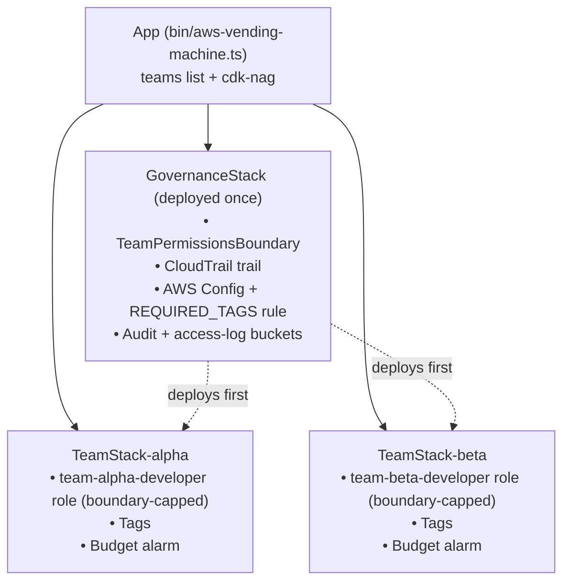

# AWS Vending Machine


An AWS CDK (TypeScript) project that **vends governed, isolated team environments on demand**. Each environment comes with guardrails already in place: IAM roles capped by a permissions boundary, mandatory tagging, a per-team budget alarm, and account-wide CloudTrail/Config logging. **cdk-nag** checks every change against AWS Well-Architected rules in **GitHub Actions CI**.

## The problem

Dev teams need AWS access to move fast. But:

- **Full admin for everyone** leads to security holes, surprise bills, and no audit trail.
- **A ticket for every resource** turns the platform team into a bottleneck.

## The solution

A vending machine: add a team to a list, deploy, and the team gets its own environment with guardrails built in. Teams self-serve, and the account stays safe.

| Guardrail | Question it answers | How |
|---|---|---|
| **Permissions boundary** | Can a team escalate its privileges or break out? | Every team role wears a boundary, a ceiling on permissions. Teams can create roles, but only ones that wear the same boundary. |
| **Mandatory tagging** | Who owns this resource? | CDK tags everything in a team's stack with `Team`, `Owner`, and `ManagedBy`. An AWS Config rule flags untagged resources created outside CDK. |
| **Budget alarms** | Is a team about to overspend? | One monthly budget per team, filtered by the `Team` tag, emails the owner at 80% of the limit. |
| **CloudTrail and Config** | *Who* did what, and *what* changed? | A multi-region CloudTrail trail with log-file validation, and a Config recorder, both writing to an encrypted, versioned, retained bucket. |
| **cdk-nag in CI** | Is the infrastructure itself well-architected? | Every push runs `cdk synth` with AWS Solutions checks. Any unacknowledged finding fails the build. |

## Architecture



```
bin/aws-vending-machine.ts            # the app: team list + cdk-nag
lib/constructs/iam-permissions-boundary.ts  # the boundary policy
lib/stacks/governance-stack.ts        # shared guardrails (once per account)
lib/stacks/team-stack.ts              # one vended environment per team
.github/workflows/ci.yml              # CI: npm ci + cdk synth (runs cdk-nag)
```

## How the permissions boundary works

A permissions boundary sets the **maximum** permissions a role can ever have. A request is allowed only if the role's own policy **and** the boundary both allow it, and an explicit Deny always wins.

The boundary allows `*` as the ceiling, then denies the escape routes:

| Statement | Blocks |
|---|---|
| `DenyRoleChangesWithoutBoundary` | Creating a role, or giving it permissions, unless it wears this boundary |
| `DenyIamUsersAndGroups` | Creating IAM users, access keys, or console logins, and granting permissions to users or groups |
| `DenyPassingNonTeamRoles` | Passing any role not named `team-*` to a service (e.g. running Lambda code as an admin role) |
| `DenyPrivilegeEscalation` | Editing managed policy versions |
| `DenyBoundaryModification` | Removing or swapping a role's boundary |
| `DenyAuditTampering` | Stopping or deleting CloudTrail, or deleting Config rules and stopping the recorder |

This is why team developer roles can safely use `AdministratorAccess`: the policy says "anything," and the boundary decides what "anything" means.

## Vending a new environment

Add a team to the list in `bin/aws-vending-machine.ts`:

```typescript
const teams = [
  { teamName: 'alpha', ownerEmail: 'alpha-lead@example.com', monthlyBudgetUsd: 50 },
  { teamName: 'beta',  ownerEmail: 'beta-lead@example.com',  monthlyBudgetUsd: 25 },
  { teamName: 'gamma', ownerEmail: 'gamma-lead@example.com', monthlyBudgetUsd: 40 }, // new
];
```

Then deploy. `TeamStack-gamma` is created with its own boundary-capped role, tags, and budget.

## Getting started

**Prerequisites:** Node.js 24+, AWS credentials configured, and the account bootstrapped for CDK (`npx cdk bootstrap`).

```bash
npm install
npx cdk synth          # type-check, synthesize, run cdk-nag
npx cdk deploy --all   # deploys GovernanceStack first, then the team stacks
```

### One-time account setup and gotchas

- **Activate the `Team` cost allocation tag** in Billing → Cost allocation tags. Without it, budgets can't filter by team and will report $0.
- **One Config recorder per region.** If the account already has one (e.g. from Control Tower), the `GovernanceStack` deploy fails. Remove the recorder resources or reuse the existing one.
- **Audit buckets are retained.** They're kept when the stack is destroyed, by design, so audit logs are never lost with a `cdk destroy`.
- **Cost:** the first CloudTrail trail is free for management events. Config charges per recorded configuration item, which is small for a test account.

## CI and cdk-nag

`.github/workflows/ci.yml` runs on every push and pull request:

1. `npm ci` installs the exact versions from `package-lock.json`.
2. `npx cdk synth` type-checks, synthesizes, and runs **cdk-nag `AwsSolutionsChecks`**.

Any Well-Architected violation fails the build before anything reaches AWS. Findings are either **fixed** (e.g. added server access logging, narrowed the Config role to its own log prefix) or **acknowledged in code with a written reason**:

| Acknowledged rule | Reason |
|---|---|
| IAM5 on the boundary | `Allow *` is the boundary's ceiling; the Deny statements do the work |
| IAM4 on team developer roles | `AdministratorAccess` is intentionally capped by the boundary |
| IAM4 on the Config role | `AWS_ConfigRole` is the AWS-maintained policy for Config |
| IAM5 on the Config role | Wildcard is limited to object keys under the Config log prefix |
| S1 on the access-log bucket | It *is* the access-log bucket; logging it to itself would loop |

Requires `aws-cdk-lib` 2.271 or later, because earlier versions reject cdk-nag 3's finding IDs.

## Design decisions

- **Single account, team environments.** Each "environment" is a set of team-scoped resources in one AWS account. That keeps the project cheap, fast to iterate on, and fully deletable. The production-grade version would vend **separate AWS accounts** with AWS Organizations and Service Control Policies (SCPs), which act like account-wide permissions boundaries.
- **Boundary created once, looked up by name.** `GovernanceStack` owns the boundary, and team stacks reference it by name and depend on `GovernanceStack`, so it always exists first.
- **Naming as a security control.** AWS has no condition key to check a boundary during `iam:PassRole`, so passable roles are identified by a reserved `team-` prefix.
- **Acknowledge, don't disable.** cdk-nag exceptions are recorded next to the code with reasons, so they stay visible and reviewable.

## Limitations and next steps

- **Boundary hardening:** also deny `cloudtrail:PutEventSelectors`, `config:DeleteConfigurationRecorder` and `config:DeleteDeliveryChannel`, deletion of the boundary policy itself, and `iam:UpdateAssumeRolePolicy` on non-team roles.
- **Tag enforcement on hand-made resources:** Config *detects* missing tags but doesn't block them. Tag policies or SCPs with `aws:RequestTag` conditions would enforce them.
- **Unit tests:** assert with `Template.fromStack` that every role has a boundary and that the PassRole rule contains the real ARN pattern.
- **Teams from config:** move the team list to a `teams.json` file so onboarding is a one-line PR.
- **Continuous deployment:** deploy automatically on merge to `main`, using GitHub OIDC instead of long-lived keys.
- **Multi-account:** vend real AWS accounts via Organizations and Control Tower Account Factory.
